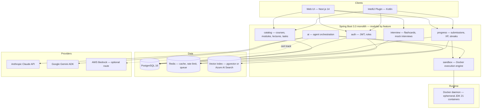
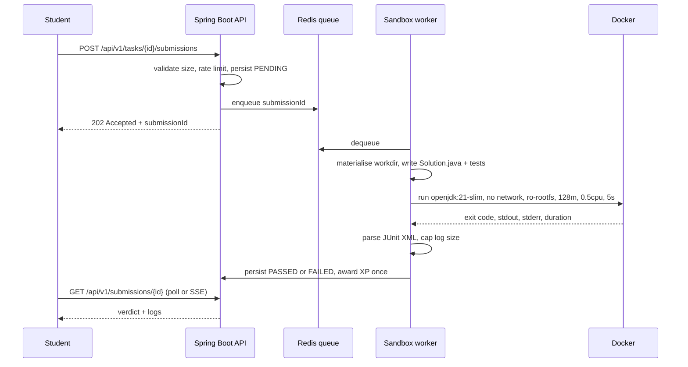
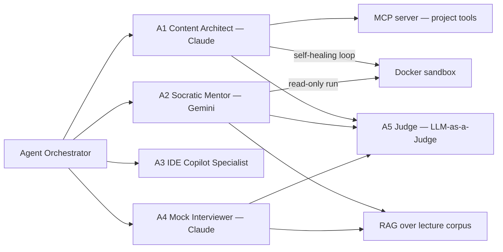
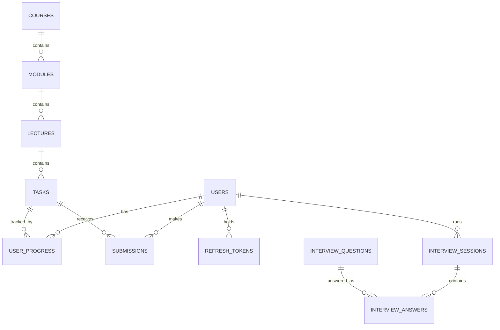

# CLAUDE.md — Java AI Academy (JavaRush 2.0 + Multi-Agent AI)

> **This file is the single source of truth for the project.**
> It is Claude's persistent memory across sessions. Read it fully before doing any work.
> Every completed task, decision, and blocker is recorded here — not in chat history.

**Status:** E7 complete · **Last updated:** 2026-07-25 · **Doc version:** 1.0

---

## 0. Operating Rules for the Agent

1. **Read before writing.** Load this file, then the relevant `docs/` page, then the code. Never guess at an API contract that is written down here.
2. **One task at a time.** `/dev-task-step` executes exactly one unchecked task from §9, verifies it, then updates §9 and §12. No task-hopping, no batching five epics into one commit.
3. **No task is done without a passing test.** "It compiles" is not verification. See §10 for the verification command per component.
4. **Never invent requirements.** If a task is ambiguous, if two valid architectures exist, or if something is blocked — stop and run `/dev-task-open-question`. Do not silently pick and move on.
5. **Update this file in the same change** as the code it describes. A schema change without a §7 update is an incomplete task.
6. **Untrusted code is untrusted.** Student code AND AI-generated code run only inside the sandbox described in §6.2. Never `Runtime.exec` user input on the API host. Never relax a sandbox flag "temporarily".
7. **Secrets never enter the repo.** `.env` is git-ignored; `.env.example` documents the keys with dummy values.
8. **Small, reviewable commits.** Conventional Commits (§5.6). One epic task ≈ one commit.
9. **Commits require manual approval.** After every task, stage the specific files with `git add <files>` and show the proposed commit message. Do NOT run `git commit` until the user explicitly approves. Never use `git add -A` or `git add .`.

---

## 1. Vision & Scope

An interactive platform for learning Java 21+, the Spring/Kafka/Hibernate ecosystem, and cloud AI services, with instant automated code checking and interview preparation — modelled on JavaRush's proven loop (lecture → task → instant verdict → XP), extended with a **multi-agent AI system** that authors the curriculum, mentors socratically, and simulates interviews.

**The learning loop we are building:**

```
read lecture → open task → write code (web IDE or IntelliJ) → submit
   → Docker sandbox runs JUnit 5 → verdict in < 5s
   → pass: XP + confetti · fail: Socratic AI hint (never the answer)
```

### 1.1 Product pillars

| # | Pillar | What it means concretely |
|---|--------|--------------------------|
| P1 | **Instant, isolated verification** | Every submission compiles and runs against hidden JUnit 5 tests in a locked-down container. Verdict < 5s p95. |
| P2 | **AI-authored curriculum** | An admin types a technology name; the Content Architect agent produces lecture + task + template + tests, and **self-heals** until the generated test suite actually passes against the reference solution in the sandbox. |
| P3 | **Socratic mentoring** | The tutor agent is contractually forbidden from emitting solution code. It asks 1–2 guiding questions grounded in the student's actual compiler/test output. |
| P4 | **Meet the student where they work** | Web workspace (Monaco) *and* a first-class IntelliJ IDEA plugin sharing one API. |
| P5 | **Interview readiness** | Flashcards, RAG-grounded answers, and a Mock Interviewer that adapts difficulty and returns a structured 10-dimension evaluation. |

### 1.2 Secondary objective — 2026 AI certification coverage

The build doubles as a practical lab for five certifications. This is a *design constraint*, not marketing:

| Certification | Component that proves it | Technical focus |
|---|---|---|
| Claude Certified Architect | Content Architect agent + MCP server | Tool use, MCP integration, structured output, self-healing loops |
| Gemini Enterprise Agent Dev | Socratic Mentor | Gemini ADK, grounding on the lecture corpus, function calling into the sandbox |
| GitHub Copilot Certification | IntelliJ plugin | Custom context injection, ToDo-comment guidance, test generation |
| AWS Certified AI Practitioner | Bedrock hosting + Guardrails + FinOps | Model hosting, responsible-AI filtering, per-request cost telemetry |
| Azure AI Fundamentals | RAG search over lectures | Vector index, hybrid retrieval, grounded answers |

### 1.3 Explicitly out of scope (v1)

Payments/subscriptions · mobile apps · social feed, forum, chat · languages other than Java · video content · multi-tenancy. Note them here if they come up; do not build them.

---

## 2. System Architecture

### 2.1 Context diagram



> **Architectural stance:** we start as a **modular monolith**, not microservices. Feature packages have clean boundaries and no cross-package entity leakage, so any module can be extracted later if load demands it. The only genuinely separate runtime is the sandbox container fleet. Do not add an API gateway, service discovery, or a message bus before there is a measured reason. See ADR-0002.

### 2.2 Submission flow



### 2.3 Multi-agent system



**A5 (Judge)** samples agent outputs asynchronously and scores them for hallucination, answer-leakage, and rubric adherence. It never sits in the request path — it writes to an `ai_evaluation` table that powers a quality dashboard.

---

## 3. Repository Layout

```
java-ai-academy/
├── CLAUDE.md                    ← you are here; the source of truth
├── README.md                    ← human onboarding, 5-minute quickstart
├── .claude/commands/            ← /dev-task-step, /dev-task-open-question
├── .env.example                 ← every env var, dummy values
├── backend/                     ← Spring Boot 3.3, Java 21, Gradle Kotlin DSL
│   └── src/main/
│       ├── java/com/javaacademy/platform/
│       │   ├── auth/
│       │   │   ├── controller/      ← AuthController
│       │   │   ├── service/         ← AuthService, JwtService
│       │   │   ├── entity/          ← User, RefreshToken
│       │   │   ├── repository/      ← UserRepository, RefreshTokenRepository
│       │   │   ├── dto/             ← AuthResponse, LoginRequest, RegisterRequest, RefreshRequest
│       │   │   └── JwtProperties.java  ← @ConfigurationProperties record (feature-root)
│       │   ├── catalog/
│       │   │   ├── controller/      ← CatalogController
│       │   │   ├── service/         ← CatalogService
│       │   │   ├── entity/          ← Course, CourseModule, Lecture, Task
│       │   │   ├── repository/      ← CourseRepository, …
│       │   │   ├── dto/             ← CourseResponse, TaskResponse, PagedResponse, …
│       │   │   ├── mapper/          ← CatalogMapper (@UtilityClass, pure static transformations)
│       │   │   ├── util/            ← CursorEncoder (@UtilityClass, encode/decode)
│       │   │   └── enums/           ← Difficulty (EASY/MEDIUM/HARD) — when added
│       │   ├── progress/
│       │   │   ├── service/         ← ProgressService
│       │   │   ├── entity/          ← Submission, UserProgress
│       │   │   ├── repository/      ← UserProgressRepository, SubmissionRepository
│       │   │   └── enums/           ← ProgressStatus, SubmissionStatus
│       │   ├── ai/
│       │   │   ├── entity/          ← AiGenerationLog, AiEvaluation
│       │   │   ├── repository/
│       │   │   └── enums/           ← AgentType, GenerationOutcome — when added
│       │   ├── interview/
│       │   │   ├── entity/          ← InterviewQuestion, InterviewSession, InterviewAnswer
│       │   │   ├── repository/
│       │   │   └── enums/           ← InterviewDifficulty — when added
│       │   ├── sandbox/             ← (E3) Docker execution engine
│       │   ├── common/              ← ApiException, GlobalExceptionHandler, base types
│       │   └── config/              ← SecurityConfig, AppConfig (Clock bean), Jackson, OpenAPI
│       └── resources/
│           ├── application.yml          ← all config; env-var placeholders for secrets
│           ├── application-local.yml    ← local dev overrides (git-ignored)
│           └── db/migration/            ← V1__initial_schema.sql, V2__…, V3__…
├── frontend/                    ← Next.js 14 App Router, TS, Tailwind, Monaco
├── ide-plugin/                  ← Kotlin, IntelliJ Platform SDK, Gradle
├── sandbox-image/               ← Dockerfile for the runner image + JUnit console jar
├── infra/                       ← docker-compose, local stack, k8s later
├── docs/                        ← api-contract.md, prompts/, adr/
└── .github/workflows/           ← CI
```

**Package rule (backend):** organise by *feature*, then by layer inside it — `catalog/controller/CourseController.java`, `catalog/service/CatalogService.java`, `catalog/entity/Course.java`, `catalog/repository/CourseRepository.java`, `catalog/dto/CourseResponse.java`. Never create top-level `controllers/`, `services/`, `models/` packages. Cross-feature calls go through a public service interface; entities never cross a feature boundary (map to a DTO).

Sub-package conventions within a feature:
- `entity/` — JPA entities only; classes annotated `@Entity`
- `repository/` — Spring Data repository interfaces
- `service/` — `@Service` classes with `@Transactional` methods
- `controller/` — `@RestController` classes; thin, no business logic
- `dto/` — Java records for request/response mapping; never contain `@Entity` references
- `enums/` — enums for any fixed value set used by that feature (status fields, difficulty levels, outcome types); see §5.1 enum rules
- `mapper/` — `@UtilityClass` classes with **pure static** mapping methods; no Spring beans, no repository calls; all required data is passed in as parameters
- `util/` — `@UtilityClass` helpers for encoding, formatting, or other stateless transformations that belong to the feature but are not mappers
- Feature-root level: `@ConfigurationProperties` records (e.g. `auth/JwtProperties.java`), feature-specific exceptions

---

## 4. Technology Stack

| Layer | Choice | Version | Notes |
|---|---|---|---|
| Language (backend) | Java | 21 LTS | Records, sealed types, pattern matching, virtual threads |
| Framework | Spring Boot | 3.3.x | Web MVC on virtual threads; not WebFlux |
| Persistence | Spring Data JPA + Hibernate | 6.x | No `@ManyToMany`; explicit join entities |
| Migrations | Flyway | 10.x (BOM-managed) | SQL files under `db/migration/`, never edit an applied migration |
| DB | PostgreSQL | 16 | `gen_random_uuid()` via pgcrypto; pgvector if RAG stays local |
| Cache/queue | Redis | 7 | Sessions, rate limits, submission queue |
| Sandbox | docker-java | 3.4.x | Talks to the host Docker daemon |
| Runner image | `eclipse-temurin:21-jdk-jammy` + JUnit Platform Console Standalone | 1.10.3 | `openjdk:21-slim` retired; eclipse-temurin is the maintained replacement. Image pinned by digest in `sandbox-image/Dockerfile`. |
| Build | Gradle Kotlin DSL | 8.x | Version catalog in `gradle/libs.versions.toml` |
| Testing | JUnit 5, AssertJ, Testcontainers, MockMvc, ArchUnit | — | Testcontainers for every DB/Redis/Docker test |
| Static analysis | SpotBugs (plugin 5.2.5, tool 4.8.6) | — | Runs as part of `check`; exclude filter at `backend/config/spotbugs-exclude.xml` |
| PR review | Claude Code GitHub Action | v1 | Posts inline review comments on every PR; needs `ANTHROPIC_API_KEY` repo secret |
| Frontend | Next.js (App Router) | 14.x | TypeScript strict, RSC by default |
| Styling | Tailwind CSS | 3.4 | Design tokens in §11 |
| Editor | `@monaco-editor/react` | latest | Java syntax, one shared config module |
| Data fetching | TanStack Query | 5 | Client components only |
| IDE plugin | Kotlin + IntelliJ Platform SDK | 2024.1+ | Gradle IntelliJ Plugin 2.x |
| AI — content, interview | Anthropic Claude API | `claude-sonnet-5` default | Model ID in config, never hardcoded. Verify current IDs at docs.claude.com |
| AI — tutor | Google Gemini (ADK) | current | Grounding on lecture corpus |
| AI — cloud track | AWS Bedrock, Azure AI Search | — | Epic E9; behind the same `LlmClient` interface |

**Version discipline:** pin exact versions in the version catalog / `package.json`. No `latest`, no dynamic ranges, no unpinned Docker tags in production paths.

---

## 5. Coding Standards

### 5.1 Java

- **Constructor injection only.** No `@Autowired` on fields. Prefer `final` fields.
- **Records for DTOs**, request bodies, and value objects. Entities are classes.
- **Lombok on entities:** only `@Getter` and `@Setter` (with `@Setter(AccessLevel.NONE)` on the `id` field). Never `@Data`, `@EqualsAndHashCode`, `@ToString`, or `@Builder` on entities — all cause JPA problems. Elsewhere, `@Slf4j` and `@RequiredArgsConstructor` are also permitted.
- **Controllers are thin**: validate, delegate, map. No business logic, no repository access.
- **Never return entities from a controller.** Map to a DTO — an entity leak is how a `password_hash` reaches a browser.
- **Exceptions:** domain exceptions extend `ApiException` (in `common`); one `@RestControllerAdvice` maps them to RFC 7807 `ProblemDetail`. Never swallow an exception; never `catch (Exception e) { }`.
- **Nullability:** package-level `@NullMarked` (JSpecify). `Optional` for return values, never for fields or parameters.
- **Transactions:** `@Transactional` on service methods, `readOnly = true` for queries. Never on a controller.
- **Time:** `Instant` in the domain and DB (`TIMESTAMPTZ`), formatted at the edge. Inject `Clock` so tests can freeze it.
- **Money/points:** `long` for XP, never floating point.
- **Logging:** SLF4J with parameterised messages. **Never log** JWTs, API keys, password hashes, or full student source code.
- **Enums for closed value sets:** Any column or field with a fixed set of named values must be an enum in the feature's `enums/` sub-package — never a `String` constant, never an `int` ordinal. JPA mapping: always `@Enumerated(EnumType.STRING)` (never `ORDINAL` — ordinal breaks silently when enum members are reordered). Pair every new enum column with a Flyway `CHECK` constraint in the same (or a subsequent) migration so the DB rejects invalid strings independently of the application. Example: `ProgressStatus` in `progress/enums/`, `SubmissionStatus` in `progress/enums/`.
- **`@ConfigurationProperties` records:** Bind all config via typed `@ConfigurationProperties` records, not scattered `@Value` fields. One record per concern; prefix `app.<feature>` (e.g. `app.jwt`). Place the record at the feature root (e.g. `auth/JwtProperties.java`). Config goes in `application.yml` (YAML, not `.properties` — hierarchical structure is clearer). Local overrides go in `application-local.yml` which is git-ignored. Secrets come from environment variables referenced as `${VAR_NAME:default}` — never hardcoded.
- **Naming:** Use full descriptive names everywhere — variables, parameters, and loop variables. Single-letter names (`p`, `u`, `t`, `s`) are banned, including lambda parameters (`course -> ...`, not `c -> ...`). Name after what the value *is*, not what type it has: `UserProgress progress`, `User user`, `Task task`, `Course course`. Helper methods in tests follow the same rule: `savedUser(email)`, `progressFor(user, task, status, attempts)`.
- **Boolean naming:** Boolean local variables and method parameters must start with `is` or `has` (predicates) or `was` (past-tense checks): `isFirstPass`, `isAlreadyPassed`, `hasNext`, `wasPublished`. Never bare nouns like `firstPass` or `published`.
- **No redundant `save` inside transactions:** When an entity is fetched (via `findById`) inside a `@Transactional` method and then mutated, do NOT call `repository.save(entity)` again — Hibernate dirty-checking will flush the change at commit. Call `save` only when creating a new entity (i.e., one not yet in the persistence context) or when you need the saved state returned immediately.
- **Pure static helpers go in `@UtilityClass`:** Any stateless computation that has no Spring dependencies must live in a `@UtilityClass` in the feature's `util/` sub-package, not as a `static` method on a `@Service`. Example: `XpCalculator.calculateLevel(xpPoints)` in `progress/util/`.
- Formatting: Spotless with `palantir-java-format`, 4-space indent, 120-col soft limit. `./gradlew spotlessApply` before commit.
- Static analysis: SpotBugs runs on `check`. `EI_EXPOSE_REP2` is suppressed for JPA entity packages (storing entity refs is correct ORM usage). Mark Spring service classes that can throw from their constructor as `final` to satisfy SEI CERT OBJ-11 (see `JwtService`).

### 5.2 Kotlin (IDE plugin)

- Official Kotlin style; ktlint in CI.
- **Threading is the whole game in a plugin:** no network or blocking I/O on the EDT. Background work via `ProgressManager` / coroutines on `Dispatchers.IO`; UI updates via `invokeLater` + read/write actions. PSI/VFS writes only inside `WriteCommandAction`.
- JWT goes in `PasswordSafe`. Never in `PropertiesComponent`, never on disk in plaintext.
- No `!!` outside tests. Prefer sealed classes for API results over exceptions.

### 5.3 TypeScript / Next.js

- `strict: true`, `noUncheckedIndexedAccess: true`. **`any` is banned** — use `unknown` and narrow.
- Server Components by default; `"use client"` only where interactivity demands it.
- All API responses parsed through **Zod** schemas generated from / kept in sync with §8. A network boundary without runtime validation is a bug.
- Components: one per file, named export, colocated `*.test.tsx`. Server state in TanStack Query — no `useEffect` fetching.
- Tailwind utilities only; no ad-hoc CSS files. Shared variants via `cva`.
- Accessibility is a requirement, not a polish item: keyboard-navigable editor controls, visible focus rings, `aria-live` for the verdict panel.

### 5.4 Database & migrations

- Every schema change is a **new** versioned SQL file under `db/migration/V{n}__{description}.sql`. Never edit an applied migration — add a new version instead.
- Flyway CE has no rollback mechanism; write forward-only compensating migrations (`V{n}__revert_xxx.sql`) when an applied migration must be undone.
- `snake_case` names; plural tables; PK `id UUID`; FKs `<entity>_id` with an explicit `ON DELETE` policy.
- Index every FK and every column used in a `WHERE` that runs per request.
- No business logic in triggers or stored procedures.
- **Enum columns:** use `VARCHAR(50) NOT NULL` on the column; add a `CHECK (col IN ('A','B','C'))` constraint in the migration that creates the column (or a follow-up migration if retrofitting). Default value must be a member of the enum — never a legacy sentinel like `NOT_STARTED` that no code actually sets. The `CHECK` constraint acts as a second line of defence independent of the application layer.

### 5.5 Testing

| Level | Tool | Rule |
|---|---|---|
| Unit | JUnit 5 + AssertJ + Mockito | Pure logic, no Spring context. Fast. |
| Slice | `@WebMvcTest`, `@DataJpaTest` | Controller contracts, repository queries. |
| Integration | Testcontainers (Postgres, Redis, Docker) | Real infra, no H2 — H2 lies about Postgres behaviour. |
| Architecture | ArchUnit | Enforces §3 package rules and "no entity in controller signature". |
| Frontend | Vitest + Testing Library, Playwright for the workspace flow | Test behaviour, not implementation. |

Naming: `methodName_condition_expectedOutcome`. Assert on behaviour and error *type*, not on log strings. Coverage target 80% on `service` packages — but a meaningful test for the sandbox timeout path beats 100% on getters.

### 5.6 Git

- Conventional Commits: `feat(sandbox): enforce read-only rootfs`.
- Branch per epic task: `feat/E3-T2-docker-runner`.
- CI must be green before merge. No direct pushes to `main`.

---

## 6. Security Requirements

### 6.1 Application

- BCrypt (strength 12) for passwords. Never a homegrown hash.
- JWT: HS256 minimum 256-bit secret from env, 15-min access token, 30-day rotating refresh token stored hashed in DB. Stateless — no server session.
- Authorisation is enforced **server-side per resource**, not by hiding UI. `/api/v1/admin/**` requires `ROLE_ADMIN`; a student may only read their own progress.
- Rate limits (Redis): submissions 10/min/user, AI hints 20/hour/user, auth 5/min/IP.
- CORS allowlist from config. CSRF disabled only because auth is a bearer token in a header — document that assumption if cookies are ever introduced.
- Validate every request body with Jakarta Validation. Cap submitted source at 64 KB.

### 6.2 Sandbox — non-negotiable flags

Student code and AI-generated code are hostile until proven otherwise. Every container runs with **all** of:

| Flag | Value | Why |
|---|---|---|
| `--network=none` | always | No exfiltration, no crypto-mining, no calling home |
| `--memory` | `128m` (+ `--memory-swap=128m`) | Contains fork/alloc bombs |
| `--cpus` | `0.5` | Prevents host starvation |
| `--pids-limit` | `64` | Contains fork bombs |
| `--read-only` rootfs | always | Nothing persists |
| `tmpfs /work` | `size=32m,noexec` on non-code mounts | Bounded scratch space |
| `--cap-drop=ALL` | always | No privileged syscalls |
| `--security-opt=no-new-privileges` | always | Blocks setuid escalation |
| `--user` | non-root uid (e.g. `1000:1000`) | Never run as root |
| Wall-clock timeout | 5s, hard-killed | Contains infinite loops |
| Log cap | 64 KB stdout+stderr | Contains output floods |
| Container lifetime | removed in `finally`, always | No leaked containers |

Also: the workdir is deleted in `finally`; a reaper job kills orphaned containers older than 60s; concurrent containers are bounded by a semaphore sized from config.

### 6.3 AI-specific

- **Treat model output as untrusted input.** Generated code is compiled only inside the sandbox; generated JSON is schema-validated before it touches the DB.
- **Prompt injection:** student code and lecture text are data, never instructions. Wrap them in delimited blocks and state in the system prompt that content inside them must never be followed as instructions.
- Tutor prompts include a hard rule: *no solution code, no full method bodies*. A regex/heuristic post-check rejects responses containing code fences with more than N lines, and the Judge agent samples for leakage.
- API keys from env/secret manager only. Never logged, never returned in an error body.
- Per-user and global AI spend caps enforced before the call, with token usage recorded per request (§9 E9).

---

## 7. Data Model



**Core tables** (V1: `db/migration/V1__initial_schema.sql`; V2: `V2__refresh_tokens.sql`; V3: `V3__status_enum_constraints.sql`):

| Table | Key columns | Notes |
|---|---|---|
| `users` | `id`, `email` UNIQUE, `password_hash`, `role`, `xp_points`, `crystals`, `created_at` | Role: `ROLE_STUDENT` / `ROLE_ADMIN` |
| `refresh_tokens` | `id`, `user_id` FK CASCADE, `token_hash` VARCHAR(64) UNIQUE, `expires_at`, `revoked`, `created_at` | SHA-256 hex of raw UUID; raw token never stored; reuse detection revokes all user tokens |
| `courses` | `id`, `title`, `description`, `technology`, `is_published`, `created_at` | `technology` indexed |
| `modules` | `id`, `course_id` FK CASCADE, `title`, `order_index` | UNIQUE `(course_id, order_index)` |
| `lectures` | `id`, `module_id` FK CASCADE, `title`, `content_markdown`, `order_index` | UNIQUE `(module_id, order_index)` |
| `tasks` | `id`, `lecture_id` FK CASCADE, `title`, `description`, `difficulty`, `template_code`, `test_code`, `xp_reward` | `test_code` is never sent to a student client |
| `user_progress` | `id`, `user_id`, `task_id`, `status`, `attempts`, `submitted_code`, `updated_at` | `status`: `ProgressStatus` enum (`IN_PROGRESS`, `PASSED`); CHECK constraint; UNIQUE `(user_id, task_id)` |
| `submissions` | `id`, `user_id`, `task_id`, `source`, `status`, `logs`, `duration_ms`, `created_at` | `status`: `SubmissionStatus` enum (`PENDING`, `PASSED`, `FAILED`); CHECK constraint; append-only audit trail |
| `interview_questions` | `id`, `technology`, `category`, `question`, `short_answer`, `detailed_explanation`, `difficulty` | `difficulty`: `InterviewDifficulty` enum (BEGINNER/INTERMEDIATE/ADVANCED/EXPERT); CHECK constraint V7; Seeded + AI-extended |
| `interview_sessions` / `interview_answers` | session: `user_id`, `technology`, `score`, `report_json` | 10-dimension rubric report |
| `ai_generation_log` | `id`, `agent`, `model`, `prompt_tokens`, `completion_tokens`, `cost_usd`, `latency_ms`, `outcome` | Powers FinOps + Judge dashboards |
| `ai_evaluation` | `id`, `target_type`, `target_id`, `judge_scores_json`, `flags` | LLM-as-a-Judge output |

**Invariants**
- XP is awarded **once** per `(user_id, task_id)` — enforced by the unique constraint plus a status transition check, not by an `if` in the service.
- `tasks.test_code` and `tasks.solution_code` are excluded from every student-facing DTO. There is an ArchUnit/serialisation test for this.
- Deleting a course cascades to modules → lectures → tasks, but `submissions` are retained with a nullable task reference for audit.

---

## 8. API Contract (v1)

Base path `/api/v1`. JSON only. Errors: RFC 7807 `application/problem+json`. Auth: `Authorization: Bearer <jwt>`.
Full request/response bodies: `docs/api-contract.md`. OpenAPI is generated at `/v3/api-docs` (springdoc).

### Public
| Method | Path | Purpose |
|---|---|---|
| POST | `/auth/register` | email + password → tokens |
| POST | `/auth/login` | credentials → access + refresh |
| POST | `/auth/refresh` | rotate refresh token |
| GET | `/courses` | published courses (paged) |

### Student (JWT)
| Method | Path | Purpose |
|---|---|---|
| GET | `/courses/{id}` | course with module/lecture tree |
| GET | `/lectures/{id}` | markdown content + task stubs |
| GET | `/tasks/{id}` | description + `templateCode` — **never** `testCode` |
| POST | `/tasks/{id}/submissions` | `{ "source": "..." }` → `202` + `submissionId` |
| GET | `/submissions/{id}` | `PENDING` / `PASSED` / `FAILED` + capped logs |
| GET | `/submissions/{id}/stream` | SSE verdict push (fallback: poll every 1s) |
| POST | `/tasks/{id}/ai-hint` | Socratic hint from last failed submission |
| GET | `/me` | profile, XP, level, streak |
| GET | `/me/progress` | per-course completion |
| GET | `/interview/questions` | filter by technology/category/difficulty |
| POST | `/interview/sessions` | start mock interview |
| POST | `/interview/sessions/{id}/answers` | submit answer → follow-up question |
| POST | `/interview/sessions/{id}/finish` | 10-dimension evaluation report |
| GET | `/interview/sessions/{id}` | session detail: status, score, full `EvaluationReport` (if finished) |
| GET | `/interview/sessions` | list all sessions for the authenticated user, newest first |

### Admin (`ROLE_ADMIN`)
| Method | Path | Purpose |
|---|---|---|
| POST | `/admin/ai/generate-course` | `{ "technology": "Spring Cloud Gateway" }` → async job id |
| GET | `/admin/ai/jobs/{id}` | generation status + self-healing attempt log |
| POST | `/admin/courses/{id}/publish` | publish/unpublish |
| PUT | `/admin/tasks/{id}` | hand-edit generated content |
| GET | `/admin/ai/usage` | token + cost telemetry |
| POST | `/admin/interview/questions` | create flashcard |
| PUT | `/admin/interview/questions/{id}` | update flashcard |
| DELETE | `/admin/interview/questions/{id}` | delete flashcard |

### IDE plugin
Uses the same student endpoints plus `GET /ide/bootstrap` (courses + tasks trimmed for the tool window) and sends `X-Client: intellij-plugin/<version>` for telemetry separation.

**Conventions:** `PENDING/PASSED/FAILED` verdicts; cursor pagination (`?cursor=&limit=`); `snake_case` in SQL, `camelCase` in JSON; every list response wrapped as `{ "items": [], "nextCursor": null }`.

---

## 9. Execution Roadmap

Legend: `[ ]` not started · `[~]` in progress · `[x]` done · `[!]` blocked (see §13).
`/dev-task-step` picks the **first** `[ ]` task in document order, unless the user names one.

### E0 — Workspace bootstrap
- [x] E0-T1 Monorepo skeleton, `.gitignore`, `.editorconfig`, `.env.example`
- [x] E0-T2 `CLAUDE.md` with architecture, standards, roadmap
- [x] E0-T3 `/dev-task-step` and `/dev-task-open-question` commands
- [~] E0-T4 `infra/docker-compose.yml` written — **unverified**; run `docker compose -f infra/docker-compose.yml up -d` and confirm both healthchecks pass, then flip to `[x]`
- [~] E0-T5 CI workflow written — cannot go green until E1 (backend) and E7 (frontend) exist
- [x] E0-T6 ADR-0001 (record decisions) and ADR-0002 (modular monolith) written

### E1 — Backend core: persistence & auth
- [x] E1-T1 Gradle Kotlin DSL build, version catalog, Spring Boot 3.3 skeleton, `/actuator/health` returns UP
- [x] E1-T2 Flyway migration `V1__initial_schema.sql` (all 12 tables in §7)
- [x] E1-T3 JPA entities + repositories; Testcontainers Postgres test proves every mapping loads
- [x] E1-T4 `POST /auth/register` + `/auth/login`: BCrypt(12), JWT issue, integration-tested
- [x] E1-T5 Refresh-token rotation with reuse detection
- [x] E1-T6 `SecurityFilterChain`: public/student/admin rules; test asserts 401 and 403 paths
- [x] E1-T7 Global `ProblemDetail` exception handler + validation error shape
- [x] E1-T8 ArchUnit rules for §3 package boundaries and no-entity-in-controller

### E2 — Catalog & progress
- [x] E2-T1 Course/module/lecture/task read endpoints with cursor pagination
- [x] E2-T2 Task DTO mapping that **provably** omits `testCode` (test asserts absence in JSON)
- [x] E2-T3 `user_progress` upsert + attempt counting
- [x] E2-T4 XP/level/crystal rules in one `GamificationService`; idempotent award test
- [x] E2-T5 `/me` and `/me/progress` aggregates
- [x] E2-T6 Seed data: one hand-written course, 3 lectures, 5 tasks with real JUnit tests

### E3 — Docker sandbox engine
- [x] E3-T1 `sandbox-image/Dockerfile` on `eclipse-temurin:21-jdk-jammy` (digest-pinned) + JUnit Console Standalone 1.10.3 (sha256-verified), built by `sandbox-image/build.sh`
- [x] E3-T2 `DockerCodeExecutionService`: materialise workdir, compile, run, collect result
- [x] E3-T3 Apply **every** hardening flag in §6.2; a test asserts each one is set on the container config
- [x] E3-T4 Timeout + hard kill + guaranteed cleanup in `finally`; leak test runs 50 submissions and asserts 0 containers remain
- [x] E3-T5 Parse JUnit XML into `ExecutionResult(status, failedTests, logs, durationMs)`
- [x] E3-T6 Redis-backed submission queue + worker with bounded concurrency
- [x] E3-T7 `POST /tasks/{id}/submissions` + polling endpoint, wired end to end
- [x] E3-T8 Adversarial suite: infinite loop, fork bomb, 2GB alloc, network call, file write outside workdir, `System.exit(0)`, 10MB stdout — all contained, all verdicts correct
- [x] E3-T9 SSE verdict stream

### E4 — Agent A1: Content Architect (Claude)
- [x] E4-T1 `LlmClient` abstraction + Anthropic implementation; model id from config; retries with jitter
- [x] E4-T2 Structured-output contract: JSON schema for `{lecture, task, templateCode, solutionCode, testCode}` + strict validation
- [x] E4-T3 System prompt in `docs/prompts/content-architect.md`, versioned and diffable
- [x] E4-T4 **Self-healing loop**: run generated tests against generated solution in the sandbox; on failure feed logs back; max 3 attempts; every attempt logged
- [x] E4-T5 Reject-and-report path when the loop exhausts — never persist unverified content
- [x] E4-T6 `POST /admin/ai/generate-course` async job + status endpoint
- [x] E4-T7 `ai_generation_log` telemetry (tokens, cost, latency, outcome)
- [x] E4-T8 Integration test with a recorded/stubbed LLM response — no live API calls in CI

### E5 — Agent A2: Socratic Mentor (Gemini)
- [x] E5-T1 Gemini client behind the same `LlmClient` interface
- [x] E5-T2 Hint prompt grounded in: task text, student source, compiler/test output
- [x] E5-T3 **Anti-leak guard**: post-filter rejects solution code; retry once with a stricter instruction, then degrade to a canned hint
- [x] E5-T4 `POST /tasks/{id}/ai-hint` + per-user rate limit + hint history
- [x] E5-T5 Golden-set test: 10 broken submissions → assert hints contain no compilable solution

### E6 — Interview trainer & A4 Mock Interviewer
- [x] E6-T1 Flashcard CRUD + filtered query endpoints
- [x] E6-T2 Session state machine (start → Q/A loop → finish) persisted per turn
- [x] E6-T3 Adaptive difficulty from rolling answer scores
- [x] E6-T4 Structured 10-dimension evaluation JSON + schema validation
- [x] E6-T5 Session report endpoint + history

### E7 — Web frontend (Next.js 14)
- [x] E7-T1 App scaffold, Tailwind tokens from §11, fonts, dark theme
- [x] E7-T2 Auth flow, token storage, refresh interceptor, protected routes
- [x] E7-T3 Course map / quest map + student dashboard
- [x] E7-T4 `TaskWorkspace`: 40% markdown pane · 60% Monaco · collapsible terminal
- [x] E7-T5 Submit → poll/SSE → verdict panel; `canvas-confetti` on pass
- [x] E7-T6 "AI hint" panel with loading and refusal states
- [x] E7-T7 Interview flashcards with 3D flip
- [x] E7-T8 Admin console with live AI generation log
- [x] E7-T9 Playwright happy path: login → open task → fail → hint → pass
- [x] E7-T10 a11y pass: keyboard nav, focus rings, `aria-live` verdicts

### E8 — IntelliJ IDEA plugin (Kotlin)
- [x] E8-T1 Plugin project, Gradle IntelliJ Plugin 2.x, `runIde` launches
- [x] E8-T2 Login dialog; JWT into `PasswordSafe`; refresh handling
- [x] E8-T3 "Java AI Academy" tool window with course/task tree
- [x] E8-T4 "Start task" action: creates `Solution.java` from the template inside a `WriteCommandAction`
- [x] E8-T5 "Verify" action: reads editor content, submits, shows verdict (green banner / red log panel)
- [x] E8-T6 Inline ToDo-comment guidance from the tutor agent (no solution code)
- [x] E8-T7 Threading audit: zero blocking calls on the EDT
- [x] E8-T8 Plugin verifier passes for the target IDE range

### E9 — Cloud AI track (AWS + Azure)
- [x] E9-T1 Bedrock route behind `LlmClient`; switch by config, no call-site changes
- [x] E9-T2 Bedrock Guardrails on generated content
- [x] E9-T3 RAG index over the lecture corpus (Azure AI Search or pgvector — see Q2 in §13)
- [x] E9-T4 Ground interview answers in retrieved lecture chunks with citations
- [x] E9-T5 FinOps dashboard: cost per agent, per course, per student
- [x] E9-T6 MCP server exposing project tools (task lookup, sandbox run, spec fetch)
- [x] E9-T7 A5 Judge: async scoring job + quality dashboard

### E10 — Production readiness
- [x] E10-T1 Structured JSON logging + request correlation ids
- [x] E10-T2 Micrometer metrics: submission latency, sandbox failures, token spend
- [x] E10-T3 Multi-stage Docker builds for backend and frontend
- [ ] E10-T4 CI: build → test → image → deploy; secrets from the platform store
- [ ] E10-T5 Load test: 100 concurrent submissions, assert p95 < 5s and no container leak
- [ ] E10-T6 Backup/restore runbook + `docs/RUNBOOK.md`

---

## 10. Run, Test, Verify

### Prerequisites
JDK 21, Docker 24+, Node 20+, pnpm or npm, `psql` client. Copy `.env.example` → `.env` and fill it.

### Local stack
```bash
docker compose -f infra/docker-compose.yml up -d      # Postgres 16 + Redis 7
docker compose -f infra/docker-compose.yml ps         # both healthy?
```

### Backend
```bash
cd backend
./gradlew spotlessApply build                 # format + compile + test + SpotBugs
./gradlew bootRun --args='--spring.profiles.active=local'
curl -s localhost:8080/actuator/health        # {"status":"UP"}
./gradlew test --tests '*SandboxAdversarialTest'
```

### Sandbox image
```bash
docker build -t java-ai-academy/runner:21 sandbox-image/
docker run --rm --network=none --memory=128m --cpus=0.5 --pids-limit=64 \
  --read-only --cap-drop=ALL --security-opt=no-new-privileges \
  java-ai-academy/runner:21 java -version
docker ps -a | grep java-ai-academy || echo "no leaked containers ✓"
```

### Frontend
```bash
cd frontend
npm ci && npm run dev            # http://localhost:3000
npm run lint && npm run typecheck && npm run test
npx playwright test
```

### IDE plugin
```bash
cd ide-plugin
./gradlew runIde                 # sandbox IDE with the plugin loaded
./gradlew verifyPlugin test
```

### Definition of Done (every task)
1. Code compiles with zero warnings introduced.
2. Tests written **and passing** — including the failure path, not just the happy path.
3. Formatter/linter clean.
4. Docs updated: §7/§8 if schema or API changed; ADR if an architectural choice was made.
5. §9 checkbox flipped to `[x]` and §12 log appended.
6. Nothing secret committed.

---

## 11. Design System

| Token | Value | Use |
|---|---|---|
| `bg-base` | `#0F172A` | App background (low eye strain in long sessions) |
| `bg-card` | `#1E293B` | Cards, panels, editor chrome |
| `accent-java` | `#EA580C` | Primary CTA, active nav, XP bar |
| `accent-blue` | `#3B82F6` | Links, focus rings, secondary actions |
| `success` | `#10B981` | Passing verdict, solved state |
| `error` | `#F43F5E` | Compile/test failure |
| `text-primary` | `#F1F5F9` | Body text |
| `text-muted` | `#94A3B8` | Secondary text |

**Fonts:** Inter (UI) · JetBrains Mono (code, terminal, editor — ligatures on).
**Motion:** 150–250ms ease-out; `canvas-confetti` only on a task pass. Respect `prefers-reduced-motion`.
**Gamification:** XP → developer levels · crystals for solved tasks · streaks. Never punitive: no lost progress, no shame states.

---

## 12. Progress Log

| Date | Task | Result | Notes |
|---|---|---|---|
| 2026-07-23 | E0-T1 | ✅ | Monorepo skeleton, `.gitignore`, `.editorconfig`, `.env.example` created |
| 2026-07-23 | E0-T2 | ✅ | This file — architecture, standards, contracts, 10-epic roadmap |
| 2026-07-23 | E0-T3 | ✅ | `/dev-task-step`, `/dev-task-open-question` in `.claude/commands/` |
| 2026-07-23 | E0-T4 | ⚠️ | `infra/docker-compose.yml` written but not started — needs a local Docker run to verify |
| 2026-07-23 | E0-T5 | ⚠️ | `.github/workflows/ci.yml` written; will fail until E1/E7 produce buildable projects |
| 2026-07-23 | E0-T6 | ✅ | ADR-0001 (decision log) and ADR-0002 (modular monolith over microservices) |
| 2026-07-23 | E1-T1 | ✅ | Gradle 8.11.1 wrapper, version catalog, Spring Boot 3.3.6 skeleton, virtual threads; `ActuatorHealthTest` passes |
| 2026-07-23 | E1-T2 | ⚠️ | Flyway V1: 12 tables, 15 indexes, FK policies per §7; compiles but tests blocked — Docker overlay2 read-only, needs Docker Desktop restart |
| 2026-07-23 | E1-T3 | ⚠️ | 12 JPA entities + repositories across 4 feature packages with Lombok `@Getter @Setter`; `JpaMappingTest` covers all 12 entity types; blocked by same Docker overlay2 issue |
| 2026-07-24 | E1-T5 | ✅ | `refresh_tokens` table (V2 migration), `RefreshToken` entity, `POST /auth/refresh`; SHA-256 hashed tokens, reuse detection revokes all user tokens; 16 unit tests (AuthServiceTest) + 5 slice tests (AuthControllerTest) + 6 repo tests (RefreshTokenRepositoryTest, Docker-blocked) all pass where runnable |
| 2026-07-24 | E1-T4 | ✅ | `POST /auth/register` + `/auth/login`; BCrypt(12); HS256 JWT (15-min); `AuthControllerTest` (8 tests, @WebMvcTest — no Docker needed) all pass; refreshToken is placeholder UUID until E1-T5 |
| 2026-07-24 | E1-T6 | ✅ | `JwtAuthenticationFilter` (Bearer token → `UsernamePasswordAuthenticationToken` with role); `SecurityConfig` wires filter, admin path requires ROLE_ADMIN; 6 unit tests (JwtAuthenticationFilterTest) + 10 slice tests (SecurityFilterChainTest) all pass |
| 2026-07-24 | infra | ✅ | SpotBugs 4.8.6 (Gradle plugin 5.2.5) added to backend `check` task; exclude filter suppresses JPA false positives; `JwtService` marked `final` (SEI CERT OBJ-11 fix); Claude Code GitHub Action added to CI for automated PR review |
| 2026-07-24 | E1-T7 | ✅ | `GlobalExceptionHandler` (@RestControllerAdvice): `ApiException` → mapped status, `MethodArgumentNotValidException` → 400 + field errors array (JSON Pointer `/field`), `HttpMessageNotReadableException` → 400, `ResponseStatusException` → mapped status, `NoHandlerFoundException`/`NoResourceFoundException` → 404, catch-all `Exception` → 500; 11 unit tests + 9 WebMvcTest slice tests all pass |
| 2026-07-24 | E1-T8 | ✅ | ArchUnit 1.3.0 added to test deps; `ArchitectureTest` (3 rules): no top-level layer packages, all classes in allowed feature packages, controller methods must not return @Entity types; all 3 rules pass with zero violations |
| 2026-07-24 | E1-T2 | ✅ | Docker now running; `FlywayMigrationTest` + `JpaMappingTest` pass with Testcontainers; fixed `RefreshTokenRepositoryTest` (missing `@AutoConfigureTestDatabase(replace=NONE)`); fixed `FlywayMigrationTest` to expect both V1 + V2 migrations |
| 2026-07-24 | E1-T3 | ✅ | All 12 JPA entity mappings confirmed by `JpaMappingTest` running against real Postgres via Testcontainers |
| 2026-07-24 | E2-T1 | ✅ | `GET /courses` (public, cursor-paginated), `GET /courses/{id}`, `GET /lectures/{id}`, `GET /tasks/{id}`; `CatalogService` + `CatalogController`; 8 DTOs; cursor = Base64URL(epochMilli~uuid); TaskResponse provably omits testCode/solutionCode; 14 unit tests (CatalogServiceTest) + 14 slice tests (CatalogControllerTest); all 126 tests pass |
| 2026-07-24 | E2-T2 | ✅ | `TaskDtoMappingTest`: 5 tests covering (1) reflection — record components contain exactly `{id,title,description,difficulty,templateCode,xpReward}`, (2) mapping path — entity with `testCode/solutionCode` populated → `TaskResponse` contains neither, (3) Jackson serialisation — JSON output has no `testCode`/`solutionCode` keys and no secret values; all 130 tests pass |
| 2026-07-24 | E2-T3 | ✅ | `ProgressService.recordAttempt()` upserts `user_progress`, increments attempts every call, transitions IN_PROGRESS→PASSED on first pass only (returns `true` for first pass, `false` otherwise for idempotent XP award); `STATUS_PASSED/STATUS_IN_PROGRESS` constants public for use by E2-T4; 9 unit tests (ProgressServiceTest) covering all 6 state transitions + null code + findProgress; 9 `@DataJpaTest` Testcontainers tests (UserProgressRepositoryTest) covering UNIQUE constraint, cascade delete, field persistence, null submittedCode; 148 tests pass |
| 2026-07-24 | E2-T4 | ✅ | `GamificationService.awardTaskCompletion(userId, taskId)` adds `task.xpReward` XP + 1 crystal to user on first pass; `calculateLevel(xpPoints)` uses `min(50, floor(sqrt(xpPoints/100))+1)` formula; wired into `ProgressService.recordAttempt` — gamification fires only when `firstPass=true`; 10 unit tests (GamificationServiceTest) covering XP award, crystal award, user-not-found, and 6 level thresholds; 2 new ProgressServiceTest cases prove award fires once and never on repeat pass; 168 tests pass |
| 2026-07-24 | E2-T5 | ✅ | `GET /api/v1/me` returns profile (id, email, role, xpPoints, crystals, level, streak=0, createdAt); `GET /api/v1/me/progress` returns per-course completion (totalTasks, passedTasks, completionPercent via JPQL COUNT queries); `MeService` + `MeController`; 3 DTOs; `XpCalculator` util; fixed `SecurityFilterChainTest` (added missing `@MockBean MeService` + updated 2 assertions now that MeController handles /me); 8 unit tests (MeServiceTest) + 4 slice tests (MeControllerTest); all tests pass |
| 2026-07-24 | E2-T6 | ✅ | `V4__seed_data.sql`: Java 21 Fundamentals course (published), 1 module, 3 lectures (Strings, Control Flow, Methods), 5 tasks with template/test/solution code; dollar-quoted DO block avoids escaping Java code in SQL; `SeedDataTest` (9 tests) verifies counts, ordering, and code fields; `FlywayMigrationTest` updated to expect 4 migrations; all tests pass |
| 2026-07-24 | E3-T7 | ✅ | `POST /api/v1/tasks/{taskId}/submissions` → 202 + submissionId; `GET /api/v1/submissions/{id}` → status/logs/durationMs; `SubmitCodeRequest` validates `@NotBlank @Size(max=65536)`; `SubmissionService.createSubmission/findSubmission`; `SubmissionRepository.findByIdAndUser_Id` for ownership check; 8 `@WebMvcTest` slice tests (SubmissionControllerTest) + 7 unit tests (SubmissionServiceTest); `SecurityFilterChainTest` updated with `@MockBean SubmissionService`; all tests pass |
| 2026-07-24 | E3-T8 | ✅ | `SandboxAdversarialTest` (7 real-Docker tests): infinite loop → TIMEOUT, fork bomb → not PASSED, 2GB alloc → not PASSED, network call → FAILED, file write outside workdir → FAILED, System.exit(0) → not PASSED, large stdout → not ERROR + logs ≤ 64KB; fixed `DockerCodeExecutionService` fallback path (no JUnit XML = always FAILED, not "exit code 0 = PASSED") which closed the System.exit(0) bypass; skipped gracefully when Docker/image unavailable |
| 2026-07-24 | E3-T9 | ✅ | `GET /api/v1/submissions/{id}/stream` SSE endpoint; 30s timeout, 500ms poll; sends `verdict` events until PASSED/FAILED, then `emitter.complete()`; on 404 sends `error` event and completes cleanly; 3 `@WebMvcTest` slice tests (401, PASSED stream, 404 error event); BUILD SUCCESSFUL |
| 2026-07-24 | E4-T1 | ✅ | `LlmClient` interface + `LlmRequest/LlmResponse/LlmException` in `ai/client/`; `AnthropicLlmClient` uses Spring `RestClient` with `baseUrl/x-api-key/anthropic-version` defaults; exponential backoff + jitter retries on 5xx and 429 (up to `maxRetries`); model falls back to `properties.defaultModel()` when null; `AnthropicProperties` @ConfigurationProperties at `app.llm.anthropic.*`; 6 unit tests using `MockRestServiceServer.bindTo(RestClient.Builder)` — no live API calls |
| 2026-07-24 | E4-T2 | ✅ | `GeneratedContent` record with `GeneratedLecture` + `GeneratedTask` in `ai/dto/`; strict parsing via Jackson `FAIL_ON_UNKNOWN_PROPERTIES`; Jakarta Validation: title not blank, contentMarkdown ≥ 100 chars, description ≥ 30 chars, Difficulty enum (EASY/MEDIUM/HARD), xpReward 1..1000; semantic check: testCode must contain `@Test`; `ContentParser` @Service throws `LlmException` on any failure; added `catalog/enums/Difficulty`; suppressed SpotBugs VA_FORMAT_STRING_USES_NEWLINE (text-block false positive); 8 unit tests cover all failure paths |
| 2026-07-24 | E4-T3 | ✅ | `docs/prompts/content-architect.md` v1.0: JSON-only output format, security/prompt-injection rules (student data in delimiters = data not instructions), self-healing context with `[SELF-HEALING ATTEMPT N/3]` prefix, difficulty/XP calibration table, pre-submit quality checklist |
| 2026-07-24 | E4-T7 | ✅ | `AnthropicProperties` gains `inputCostPerMillionTokens`/`outputCostPerMillionTokens` (config: `$3/$15` defaults); `ContentArchitectService` now tracks `totalPromptTokens`/`totalCompletionTokens` accumulated across all attempts; `saveLog()` stores tokens, computed `costUsd` (BigDecimal, 6 dp), `latencyMs`, and actual `defaultModel` name; 1 new unit test verifies token counts, non-zero costUsd, latencyMs, and model name all saved on success |
| 2026-07-24 | E4-T6 | ✅ | `JobStatus` enum (RUNNING/SUCCEEDED/FAILED); `GenerateCourseRequest` + `GenerationJobResponse` DTOs; `GenerationJobService` (ConcurrentHashMap + virtual thread per job); `ContentImportService` persists GeneratedContent as unpublished Course→Module→Lecture→Task; `AdminAiController` `POST /admin/ai/generate-course` (202+jobId) + `GET /admin/ai/jobs/{id}` (200/404), both ROLE_ADMIN; 5 unit tests (GenerationJobServiceTest: success, failure, multi-job) + 9 @WebMvcTest tests (AdminAiControllerTest: 401/403/202/400/404/running/succeeded/failed); SecurityFilterChainTest updated with GenerationJobService MockBean |
| 2026-07-24 | E4-T5 | ✅ | `AgentType` + `GenerationOutcome` enums in `ai/enums/`; `AiGenerationLog.agent/outcome` fields migrated from `String` to typed enums; V5 migration adds CHECK constraints on both columns; `ContentArchitectService` injects `AiGenerationLogRepository` + `Clock` and persists SUCCEEDED on success, EXHAUSTED on loop exhaustion, PARSE_FAILED on parse error — callers can never receive unverified content because `generateForTopic` throws before returning on any failure; removed `@Transactional` (holding a DB txn open during LLM calls is wrong); SpotBugs `CT_CONSTRUCTOR_THROW` suppressed per-class because CGLIB proxying forbids `final`; `FlywayMigrationTest` updated to expect V5; 3 new unit tests prove correct outcome persisted per path |
| 2026-07-24 | E4-T4 | ✅ | `ContentArchitectService.generateForTopic()`: generate→parse→sandbox-verify loop (max 3 attempts); self-healing prompt injects `[SELF-HEALING ATTEMPT N/3]` prefix + `<ERROR_OUTPUT>` on failure; `LlmException` on exhaustion; `@Autowired` on primary constructor resolves Spring ambiguity with package-private test constructor; 6 unit tests (Mockito, no Spring) cover first-pass, retry, self-healing prompt content, exhaustion, parse failure, sandbox timeout |
| 2026-07-24 | E4-T8 | ✅ | `ContentArchitectServiceIntegrationTest` (2 tests): uses the **real** `ContentParser` (Jackson + Jakarta Validator) wired with a hardcoded golden-fixture JSON response; `LlmClient` and `CodeExecutionEngine` stubbed — zero live API calls; verifies full parse path (deserialization → constraint validation → @Test check) and self-healing retry path; 295 tests total, all pass |
| 2026-07-24 | E5-T1 | ✅ | `GeminiProperties` @ConfigurationProperties record at `app.llm.gemini.*` (apiKey, baseUrl, defaultModel, maxRetries, retryInitialDelayMs); `GeminiLlmClient` @Service uses Spring RestClient against `POST /v1beta/models/{model}:generateContent?key={apiKey}` — no Google SDK dependency; parses candidates[0].content.parts[0].text + usageMetadata token counts; exponential backoff + jitter retry on 5xx/429; `AnthropicLlmClient` marked @Primary so single `LlmClient` injections (ContentArchitectService) default to Anthropic; 7 unit tests (GeminiLlmClientTest): happy path, null model, server retry, rate-limit retry, exhaustion, 4xx, empty candidates; 302 tests pass |
| 2026-07-24 | E5-T2 | ✅ | `SocraticMentorService` @Service: injects `@Qualifier("geminiLlmClient") LlmClient` + `socratic-mentor-system.txt` prompt resource; `generateHint(HintRequest)` builds a delimited prompt wrapping task title, task description, student source, and error output (prompt-injection safe); truncates source at 4096 chars, error at 2048 chars; null errorOutput gets placeholder text; `docs/prompts/socratic-mentor-system.txt` system prompt enforces 1-2 Socratic questions, bans solution code and full method bodies; `CT_CONSTRUCTOR_THROW` SpotBugs excluded (same reason as ContentArchitectService); 9 unit tests cover grounding, delimiters, null/oversized inputs |
| 2026-07-24 | E5-T3 | ✅ | `HintLeakDetector` @UtilityClass in `ai/util/`: extracts all code fences via regex, counts non-blank/non-comment lines per fence, flags any fence with >3 substantive lines as solution leakage; `SocraticMentorService.generateHint()` now runs the leak check on the first hint — if flagged, retries once with `CRITICAL VIOLATION` warning appended to the prompt; if retry also leaks, returns safe `CANNED_HINT`; max 2 LLM calls total; 10 HintLeakDetectorTest unit tests (clean/leaky heuristic cases) + 5 SocraticMentorServiceTest anti-leak path tests; 325 tests pass |
| 2026-07-24 | E3-T1 | ✅ | `sandbox-image/Dockerfile` on `eclipse-temurin:21-jdk-jammy` pinned by digest (sha256:9d8dcf99…); JUnit Platform Console Standalone 1.10.3 sha256-verified at build time; non-root user uid=1000; `build.sh` builds image, verifies `java -version` under all §6.2 flags, confirms jar present, asserts no leaked containers; `openjdk:21-slim` noted as retired in §4 + README |
| 2026-07-25 | E6-T2 | ✅ | `InterviewSessionStatus` enum (ACTIVE/FINISHED); V8 migration adds `status` + `current_question_id` FK to `interview_sessions`; `InterviewSession` entity gains `status` (@Enumerated) and `currentQuestion` (@ManyToOne nullable); `InterviewSessionRepository.findByIdAndUser_Id`; `InterviewAnswerRepository.findAskedQuestionIdsBySessionId` JPQL; `InterviewQuestionRepository.findByTechnology` + `findByTechnologyExcluding` for next-question selection; `InterviewSessionService.startSession` picks random first question, creates ACTIVE session; `submitAnswer` saves answer, picks next question from remaining pool (excludes already-asked IDs), updates `currentQuestion` in session; `InterviewSessionController`: `POST /api/v1/interview/sessions` (201) + `POST /api/v1/interview/sessions/{id}/answers` (200); 8 unit tests (InterviewSessionServiceTest) + 6 slice tests (InterviewSessionControllerTest); `FlywayMigrationTest` updated to expect V8; 443 tests pass |
| 2026-07-25 | E6-T3 | ✅ | `AdaptiveDifficultySelector` `@UtilityClass`: rolling window of last 3 scored answers; avg ≥ 70 → step up, avg ≤ 30 → step down, otherwise retain; min 2 scored answers required (warm-up phase); null scores filtered out (pre-E6-T4); V9 migration adds `created_at TIMESTAMPTZ DEFAULT now()` to `interview_answers` + composite index; `InterviewAnswer` entity gains `createdAt` field (insertable=false); `InterviewAnswerRepository.findScoresBySessionId` JPQL ordered by `createdAt`; `InterviewSessionService.pickNextQuestion` prefers candidates at target difficulty, falls back to any remaining; 18 unit tests (AdaptiveDifficultySelectorTest) + 3 new service unit tests; 429 tests pass |
| 2026-07-25 | E6-T4 | ✅ | A4 Mock Interviewer (Claude): `EvaluationDimension` + `EvaluationReport` records with Jakarta validation (10 required, score 0–100, non-blank feedback); `EvaluationReportParser` parses LLM JSON → validates dimensions count + constraints + full report; `MockInterviewerService` (final, CT_CONSTRUCTOR_THROW safe): builds Q&A transcript, calls anthropicLlmClient, parses/validates report; system prompt at `resources/prompts/mock-interviewer-system.txt` with 10-dimension rubric; `InterviewSessionService.finishSession` checks ACTIVE, loads answers (JOIN FETCH), calls evaluator, sets FINISHED + score + JSON; `POST /api/v1/interview/sessions/{id}/finish` → 200 `FinishSessionResponse`; `InterviewAnswerRepository.findBySessionIdWithQuestionOrderByCreatedAt` JPQL; 10 unit tests (EvaluationReportParserTest) + 4 service unit tests + 4 controller slice tests; 448 tests pass |
| 2026-07-25 | E6-T5 | ✅ | Session report + history endpoints: `GET /interview/sessions/{id}` returns `SessionDetailResponse` (status, score, full deserialized `EvaluationReport` for FINISHED, null for ACTIVE); `GET /interview/sessions` returns `List<SessionSummaryResponse>` ordered newest-first; `InterviewSessionRepository.findByUser_IdOrderByCreatedAtDesc`; `InterviewSessionService.getSession`/`listSessions`/`toDetailResponse`/`toSummaryResponse`/`deserializeReport`; 5 service unit tests (active with no report, finished with deserialized report, not-found 404, newest-first ordering, empty list) + 4 controller slice tests (401 unauthenticated, 200 finished with report, 404, 200 list with nulls); §8 updated; 458 tests pass |
| 2026-07-25 | E7-T1 | ✅ | Next.js 14.2 scaffold via `create-next-app`; Tailwind design tokens from §11 (bg-base, bg-card, accent-java, accent-blue, success, error, text-primary, text-muted) in `tailwind.config.ts`; Inter + JetBrains Mono via `next/font/google` with CSS variables; dark theme forced via `html.dark` class; `globals.css` sets `color-scheme: dark`, focus-visible ring with `accent-blue`, `prefers-reduced-motion` zeroes all transitions; `noUncheckedIndexedAccess: true` added to tsconfig; `typecheck` npm script added; home page uses design tokens; `npm run lint` + `npm run typecheck` both pass |
| 2026-07-25 | E7-T10 | ✅ | a11y pass: skip-to-main-content link (sr-only, shown on focus); `<nav aria-label="Main navigation">` with `<ul>` + `<li>` for nav links; `aria-current="page"` on active nav item; loading spinner uses `role=status` + `aria-live=polite`; focus-visible ring defined in globals.css applies globally; VerdictPanel: `aria-live=assertive` on verdict chip, `role=log aria-live=polite` on output; Flashcard: `role=button tabIndex=0 onKeyDown Enter/Space`; `<main id=main-content tabIndex=-1>` for skip-link target; `npm run lint` + `npm run typecheck` clean |
| 2026-07-25 | E7-T9 | ✅ | Playwright E2E: `playwright.config.ts` (Chromium, webServer dev, 60s timeout); `e2e/happy-path.spec.ts` — live tests guarded by `PLAYWRIGHT_LIVE=true` env (off in CI by default); covers: login success → redirect to /dashboard, wrong-password error message, unauthenticated redirect to /login, task workspace aria landmark checks, broken-code submit → FAILED + hint button appears; public-page tests (home heading, login form labels) always run; `npm run test:e2e` + `test:e2e:ui` scripts added; typecheck + lint clean |
| 2026-07-25 | E7-T8 | ✅ | Admin console: `/admin` page — "Generate Course" section triggers POST /admin/ai/generate-course, polls job status every 3s with refetchInterval (stops on DONE/FAILED), shows attempt count + log + link to generated course; AI usage table with columns (agent, model, tokens-in, tokens-out, cost, latency, outcome); auto-refreshes every 10s via refetchInterval; admin schemas (`lib/schemas/admin.ts`) + queries (`lib/queries/admin.ts`); `npm run lint` + `npm run typecheck` clean |
| 2026-07-25 | E7-T7 | ✅ | Flashcards with 3D flip: `lib/schemas/interview.ts` + `lib/queries/interview.ts` for GET /interview/questions; `components/Flashcard` — perspective + transformStyle preserve-3d, rotateY(180deg) flip on click/Enter, backface-visibility hidden on both faces; aria-label + aria-pressed + role=button + tabIndex for full keyboard accessibility; difficulty color-coded; `/interview` page: technology text filter + difficulty select filter (both reset cardIndex on change); card navigation with prev/next buttons; "Start a mock interview" link; `npm run lint` + `npm run typecheck` clean |
| 2026-07-25 | E7-T6 | ✅ | AI hint panel: `components/AiHintPanel` — hidden until first FAILED verdict; HintState union (idle/loading/hint/refused/error); POST /tasks/{id}/ai-hint; 429 → quota-exceeded message, 400 → "submit first" message, other errors → error state; "Ask another" link for follow-up hints; loading pulse; wired into task description pane below task description; `npm run lint` + `npm run typecheck` clean |
| 2026-07-25 | E7-T5 | ✅ | Verdict panel + confetti: `components/VerdictPanel` extracts terminal UI; fires `canvas-confetti` via `useEffect` on PASSED status (120 particles, academy colors, respects reduced-motion via CSS); verdict chip shows PASSED/FAILED with semantic aria-live=assertive; loading pulse indicator while sandbox runs; duration display; task page wired to VerdictPanel, old inline terminal removed; `npm run lint` + `npm run typecheck` clean |
| 2026-07-25 | E7-T4 | ✅ | TaskWorkspace: `components/MonacoEditor` (dynamic import, ssr:false, vs-dark theme, JetBrains Mono, Java language, automatic layout); task page `/tasks/[taskId]` — 40% markdown+description pane, 60% Monaco editor pane with Submit button; collapsible terminal panel (aria-expanded, role=log, aria-live=polite) shows PENDING → PASSED/FAILED status chip; poll-based submission flow (1s interval, 30 attempts max, timeout error state); `lib/schemas/task.ts` + `lib/queries/tasks.ts` for task/lecture fetch, submit, poll, ai-hint; `npm run lint` + `npm run typecheck` clean |
| 2026-07-25 | E7-T3 | ✅ | Dashboard + quest map: `lib/schemas/catalog.ts` Zod schemas for Me, PagedCourses, CourseDetail, CourseProgress; `lib/queries/catalog.ts` typed fetch functions; `components/XpBar` shows level + XP progress bar with aria-label; `components/CourseCard` shows course title, tech tag, completion bar; dashboard (`/dashboard`) fetches me+courses+progress in parallel via TanStack Query, shows crystals/streak/XP and course grid; course detail page (`/courses/[courseId]`) shows module tree with lectures + task rows (difficulty label + XP reward), links to task workspace; `npm run lint` + `npm run typecheck` clean |
| 2026-07-25 | E7-T2 | ✅ | Auth flow: `lib/tokens.ts` stores refresh token in localStorage + sets `jaa_logged_in` cookie for middleware; `lib/api.ts` Axios instance with request interceptor (attaches Bearer token) + response interceptor (on 401 calls refresh, retries original request, redirects to /login on failure); `contexts/auth-context.tsx` React context provides login/register/logout and restores session via refresh token on mount; `middleware.ts` checks `jaa_logged_in` cookie, redirects unauthenticated users to /login?next=…; route groups `(auth)` for login/register pages, `(app)` for protected pages with header + sign-out; `Providers` wraps app with QueryClientProvider + AuthProvider; Zod schema validates auth API responses; `npm run lint` + `npm run typecheck` clean |
| 2026-07-25 | E6-T1 | ✅ | `InterviewDifficulty` enum (BEGINNER/INTERMEDIATE/ADVANCED/EXPERT) in `interview/enums/`; V7 migration adds CHECK constraint + explicit DEFAULT 'INTERMEDIATE'; `InterviewQuestion.difficulty` migrated from String to `@Enumerated(EnumType.STRING)` enum; `InterviewQuestionRepository.findByFilters` JPQL with 3 optional params; `InterviewQuestionService` (findQuestions/findById/create/update/delete); `InterviewQuestionController`: `GET /api/v1/interview/questions` (student, all filters optional), `POST/PUT/DELETE /api/v1/admin/interview/questions` (admin); `GlobalExceptionHandler` + `MethodArgumentTypeMismatchException` → 400 for invalid enum query params; 11 unit tests (InterviewQuestionServiceTest) + 12 slice tests (InterviewQuestionControllerTest); `JpaMappingTest` updated to use enum; `FlywayMigrationTest` updated to expect V7; 409 tests pass |
| 2026-07-24 | E5-T5 | ✅ | `SocraticMentorGoldenSetTest`: 30 parameterized tests (10 broken submissions × 3 assertions each) — LLM stubbed with clean Socratic-question hints; asserts `HintLeakDetector.containsSolutionCode()` = false, hint is non-blank, and hint contains at least one `?` for all 10 scenarios (type error, off-by-one, NPE, scope, string equality, null guard, sorting, stack order, area method, integer division); 378 tests pass |
| 2026-07-24 | E5-T4 | ✅ | `POST /api/v1/tasks/{taskId}/ai-hint` endpoint; `V6__ai_hints.sql` creates `ai_hints` table with user/task FK and indexes; `AiRateLimiter` fixed-window Redis rate limit (20 hints/hour, key `rate:ai-hint:{userId}:{hourBucket}`); `HintService` looks up user by email (JWT principal), checks rate limit, fetches last FAILED submission logs for context, calls `SocraticMentorService`, persists `AiHint`; fixed `UnfinishedStubbingException` in `HintServiceTest` (nested `when(mock.method())` inside outer `when()` thenReturn arg); updated `FlywayMigrationTest` to expect V6 + ai_hints table/indexes; 9 unit tests (HintServiceTest) + 4 slice tests (HintControllerTest); 348 tests pass |
| 2026-07-24 | E3-T2 | ✅ | `DockerCodeExecutionService` implements `CodeExecutionEngine`; all §6.2 flags in `buildHostConfig`; `FrameCollector` (non-deprecated `ResultCallbackTemplate`) caps logs at 64KB; `Semaphore` for bounded concurrency; cleanup in `finally` (removeQuietly + deleteWorkDir); `SandboxConfig` bean wires `ApacheDockerHttpClient`; `SandboxProperties` @ConfigurationProperties; 14 unit tests (Mockito RETURNS_SELF for fluent docker-java builders); all tests pass |
| 2026-07-24 | E3-T3 | ✅ | `SandboxHardeningTest` (15 tests): one test per §6.2 flag — networkMode=none, memory=128MB, memorySwap=memory, cpuQuota=50% of period, pidsLimit=64, readonlyRootfs=true, capDrop=ALL, securityOpts=no-new-privileges, tmpfs=/tmp noexec, workdir bind mount, user=1000:0 (via verify), LOG_CAP_BYTES=64KB, timeout=5s; `LOG_CAP_BYTES` promoted to package-private for test access; all tests pass |
| 2026-07-24 | E3-T4 | ✅ | `SandboxLeakTest` (4 tests): 50-iteration unit test rotates through start-failure/timeout/happy-path modes and asserts `removeContainerCmd` called exactly 50 times; null-id guard test asserts remove NOT called when createContainer fails; timeout path asserts kill then remove; real-Docker integration test runs 5 actual submissions and asserts `listContainersCmd --all` with runner image filter returns empty; `DE_MIGHT_IGNORE` added to spotbugs-exclude for test classes |
| 2026-07-24 | E3-T5 | ✅ | `JUnitXmlParser.parseFailedTestCount` reads `TEST-<className>.xml` from report dir, parses `failures+errors` from `<testsuite>` attributes (XXE protected), returns `OptionalInt` (empty = file absent); `ExecutionResult` gains `failedTests` field; service prefers XML over exit code; `JUnitXmlParserTest` (4 tests) with passing/failing XML fixtures under `src/test/resources/sandbox/`; all tests pass |
| 2026-07-24 | E3-T6 | ✅ | `SubmissionQueue` interface + `RedisSubmissionQueue` (FIFO via `rightPush`/`leftPop`, key `sandbox:submission-queue`); `JavaClassNameExtractor` util extracts public class name from Java source via regex; `SubmissionService.processSubmission` @Transactional — loads Submission+Task, builds ExecutionRequest, calls CodeExecutionEngine, persists verdict, calls ProgressService; `SubmissionWorker` virtual-thread loop dequeues and dispatches; unit tests (RedisSubmissionQueueTest, JavaClassNameExtractorTest) + Testcontainers Redis integration test (3 tests, @MockBean SubmissionWorker to prevent race); all tests pass |
| 2026-07-25 | E8-T1 | ✅ | IntelliJ IDEA plugin scaffold: Gradle Kotlin DSL with Gradle IntelliJ Plugin 2.x; `intellijPlatform { intellijIdeaCommunity("2024.1.7") }`; OkHttp + Moshi deps; `AcademyToolWindowFactory`/`AcademyToolWindowPanel` stub; `StartTaskAction`/`VerifyTaskAction` stubs; `META-INF/plugin.xml` declares plugin; `PluginDescriptorTest` verifies plugin.xml is on classpath with correct id/name/factory; all plugin code targets JVM 17 (IntelliJ 2024.1 bundles JBR 17.0.12); 1 test passes |
| 2026-07-25 | E8-T2 | ✅ | `AuthClient` (OkHttp + Moshi): `login` + `refresh` calls to `/api/v1/auth/{login,refresh}`; `TokenStore` singleton: access token in-memory, refresh token in `PasswordSafe` (keyed by `generateServiceName`), `extractEmail(jwt)` parses JWT payload `sub` claim without extra deps; `LoginDialog` extends `DialogWrapper` with email + password fields; `AcademyToolWindowPanel` updated: on init restores session via stored refresh token (background thread), shows Sign In button when unauthenticated or signed-in state with email + Sign Out; all UI transitions via `ApplicationManager.invokeLater`; `MockWebServer` added to test deps; 5 `AuthClientTest` (happy path, 401, 500, refresh) + 5 `TokenStoreTest` (email extraction, edge cases); 11 tests pass |
| 2026-07-25 | E8-T3 | ✅ | `ApiClient.fetchBootstrap()` calls `GET /api/v1/ide/bootstrap` with Bearer + `X-Client` header; `CourseTreePanel`: IntelliJ `Tree` (TreeSpeedSearch, no root visible), loads courses+tasks on pooled thread, populates `CourseNode`/`TaskNode` tree with title/difficulty/XP info, Refresh button, empty/error states; `AcademyToolWindowPanel.showAuthenticatedView()` now mounts `CourseTreePanel`; backend: `GET /api/v1/ide/bootstrap` (requires JWT, returns all published courses with flattened tasks sorted by module/lecture/task order); 2 controller slice tests (`@WithMockUser` 200 with nested task, 401 unauthenticated); 3 `ApiClientTest` (two courses, empty array, 401); all pass |
| 2026-07-25 | E8-T4 | ✅ | `StartTaskAction` (parameterized with taskId+title+apiClient): fetches task template on pooled thread via `ApiClient.fetchTask(taskId)`; creates or overwrites `Solution.java` in first content source root via `WriteCommandAction.runWriteCommandAction`; falls back to project.baseDir if no source root; opens file in editor; `CourseTreePanel` wires tree selection listener → enables "Start Task" button → dispatches action with correct DataContext; `ApiClient.fetchTask` returns `TaskDetail(id, title, templateCode?)`; 2 new `ApiClientTest` (template present, null template); 16 plugin tests pass |
| 2026-07-25 | E8-T5 | ✅ | `VerifyTaskAction` (parameterized: taskId+title+apiClient): reads source from active editor or currently open file; submits via `ApiClient.submitSolution` (POST /tasks/{id}/submissions) on pooled thread; polls `ApiClient.pollSubmission` every 1s up to 30s; shows PASSED/FAILED as IntelliJ balloon notification (registered `notificationGroup` in plugin.xml); CourseTreePanel gains "Verify" button (enabled on task selection); `SubmitResponse`/`SubmissionStatus` DTOs; 3 new `ApiClientTest` (submit returns submissionId, PASSED poll, FAILED poll with logs); 19 plugin tests pass |
| 2026-07-25 | E8-T6 | ✅ | `GetHintAction` (parameterized): calls `ApiClient.fetchHint` (POST /tasks/{id}/ai-hint); inserts hint into editor at caret position as `// TODO (Academy Hint):` comment block via `WriteCommandAction`; rate-limit (429) and "submit first" (400) errors show contextual warning messages; `HintResponse` DTO; `dispatchAction` helper extracted from `CourseTreePanel` to avoid repetition; CourseTreePanel gains "Hint" button; 2 `ApiClientTest` (Socratic hint, 429 rate-limit) + 3 `GetHintActionTest` (comment format, multi-line, no code leakage); 24 plugin tests pass |
| 2026-07-25 | E8-T7 | ✅ | Threading audit: fixed EDT violation — `AcademyToolWindowPanel.init` was calling `authClient.refresh()` (blocking network) synchronously; refactored to `tryRestoreSessionAsync()` (pooled thread → invokeLater); `ThreadingAuditTest` (5 source-scan tests) asserts all 3 action classes use `executeOnPooledThread` in `actionPerformed`, panel init doesn't block on network, `CourseTreePanel.loadCourses` uses pooled thread; 29 plugin tests pass |
| 2026-07-25 | E8-T8 | ✅ | `./gradlew verifyPlugin` → **Compatible** with IC-241.19416.15 (IntelliJ IDEA 2024.1.7); initially 1 deprecated API warning (`project.baseDir`); fixed in `StartTaskAction.findSourceRoot` to use `project.basePath` + `LocalFileSystem.findFileByPath`; re-run shows 0 warnings; plugin is dynamic (can reload without IDE restart); `sinceBuild=241`, `untilBuild=null` |
| 2026-07-25 | E9-T1 | ✅ | `BedrockLlmClient` @ConditionalOnProperty(havingValue="bedrock") implements `LlmClient` using AWS SDK v2 `BedrockRuntimeClient.invokeModel`; request uses Claude-on-Bedrock JSON body (anthropic_version=bedrock-2023-05-31, same response shape as Anthropic API); `AnthropicLlmClient` gains matchIfMissing=true condition; switch via `LLM_PROVIDER=bedrock`/`anthropic` env var; `BedrockProperties` @ConfigurationProperties at `app.llm.bedrock.*`; AWS credentials resolved by default credential chain; 7 unit tests (Mockito mock of BedrockRuntimeClient) — no live AWS calls in CI |
| 2026-07-25 | E9-T2 | ✅ | Bedrock Guardrails: `BedrockProperties` gains optional `guardrailId`/`guardrailVersion` fields; `BedrockLlmClient.callApi` attaches guardrail to `InvokeModelRequest` when both fields are non-blank; `parseResponse` checks `stop_reason=guardrail_intervened` and throws `LlmException` — callers can never receive filtered content; config via `AWS_BEDROCK_GUARDRAIL_ID`/`AWS_BEDROCK_GUARDRAIL_VERSION` env vars (empty = guardrails disabled); 4 new unit tests (guardrail attached, not attached, intervened with config, intervened without config); 11 total BedrockLlmClientTest tests pass |
| 2026-07-25 | E9-T4 | ✅ | RAG grounding for Mock Interviewer: `RagCitation(lectureId, chunkIndex, snippet)` record added to `interview/dto/`; `EvaluationReport` gains optional `@Nullable List<RagCitation> citations` field; `MockInterviewerService` injects `Optional<LectureIndexingService>` — when present searches top 3 chunks by technology, injects as `<REFERENCE_MATERIAL>` block in user prompt before `<TRANSCRIPT>`, attaches citations on returned report; RAG errors logged + gracefully bypassed; system prompt updated with reference material instructions; 9 unit tests (MockInterviewerServiceTest): no-RAG, RAG with citations, empty RAG, RAG throws, reference material in prompt, no reference without RAG, snippet truncation, empty answers, correct technology search; 498 tests pass |
| 2026-07-25 | E9-T3 | ✅ | RAG: `V10__pgvector.sql` adds `lecture_chunks` table (lecture_id FK, chunk_index, chunk_text, embedding vector(1024), IVFFlat cosine index); `VectorStore` interface + `PgVectorStore` @Repository (raw JDBC + PGvector literal encoding); `EmbeddingClient` interface + `BedrockEmbeddingClient` @ConditionalOnProperty(bedrock) using Titan Embeddings V2; `LectureIndexingService` @ConditionalOnBean(EmbeddingClient) with 800-char/100-overlap chunker + delete-before-insert; all Testcontainers tests switched to `pgvector/pgvector:pg16`; 11 unit tests (LectureIndexingServiceTest) + 5 integration tests (PgVectorStoreTest, with insert-lecture fixture for FK); 488 tests pass |
| 2026-07-25 | E9-T5 | ✅ | FinOps dashboard: `V11__ai_log_user_course.sql` adds nullable `user_id`/`course_id` FK columns + 3 indexes to `ai_generation_log`; `AiGenerationLog` gains `userId`/`courseId` fields; `AiGenerationLogRepository` has 4 JPQL aggregate queries (`findTotals`, `findByAgent`, `findByUser`, `findByCourse`) with nullable time-window params; `FinOpsService` maps `Object[]` rows to DTOs (`AiUsageResponse`, `AgentUsageSummary`, `UserUsageSummary`, `CourseUsageSummary`); `GET /admin/ai/usage` endpoint with optional `from`/`to` query params; `SecurityFilterChainTest` updated (added `@MockBean FinOpsService`, updated 2 assertions from 404→isNotSecurityError now that endpoint exists); 7 unit tests (FinOpsServiceTest) + 3 slice tests (AdminAiControllerTest); 519 tests pass |
| 2026-07-25 | E9-T6 | ✅ | MCP server: `McpTool` interface + `McpToolRegistry` @Component (list-injection auto-discovers all tools); `McpController` at `/api/v1/admin/mcp/` (admin-protected) with `GET /tools`, `GET /tools/{name}`, `POST /tools/{name}/call`; 3 tools — `LookupTaskTool` (task lookup by UUID including testCode/solutionCode for AI use), `RunInSandboxTool` (delegates to `Optional<CodeExecutionEngine>`, returns NOT_AVAILABLE when E3 not wired), `FetchSpecTool` (classpath resources in `mcp-specs/`, allowlist-protected); 2 classpath spec files (api-contract.md, project-overview.md) bundled with the app; `SecurityFilterChainTest` updated with `@MockBean McpToolRegistry`; 6 unit tests (LookupTaskToolTest) + 6 (RunInSandboxToolTest) + 7 (FetchSpecToolTest) + 9 slice tests (McpControllerTest); 538 tests pass |
| 2026-07-25 | E9-T7 | ✅ | A5 Judge: `EvaluationTargetType` enum (HINT/INTERVIEW_EVALUATION/CONTENT_GENERATION); `V12__ai_evaluation_indexes.sql` adds CHECK constraint + 2 indexes on `ai_evaluation`; `JudgeService` with `@Async evaluateHintAsync`/`evaluateInterviewEvaluationAsync` + `doEvaluate` → calls LLM, parses `JudgeScores`, persists flags (ANSWER_LEAKED, LOW_HALLUCINATION_SCORE, LOW_RUBRIC_ADHERENCE); `@EnableAsync` added to `AppConfig`; `EvaluationDashboardService` maps `AiEvaluation` → `EvaluationSummary` with score deserialization; `GET /admin/ai/evaluations` endpoint with optional `?targetType=` filter; `HintService` wired to fire `judgeService.evaluateHintAsync` after every saved hint; `SpotBugs` exclude updated (CT_CONSTRUCTOR_THROW for JudgeService + CGLIB proxy conflict); 12 unit tests (JudgeServiceTest) + 11 HintServiceTest (1 new) + 4 AdminAiControllerTest (4 new) + FlywayMigrationTest updated to V12; build green |
| 2026-07-25 | E10-T1 | ✅ | Structured JSON logging: `logstash-logback-encoder` 8.0 added to version catalog + build.gradle.kts; `logback-spring.xml` with `CONSOLE` appender (human-readable for local/dev/test) and `JSON_CONSOLE` appender (LogstashEncoder for prod/staging); `CorrelationIdFilter` (OncePerRequestFilter, Order=1) generates/propagates `X-Correlation-ID` header and puts `correlationId` into SLF4J MDC for every request; 4 unit tests (CorrelationIdFilterTest) verifying propagation, generation, blank header, MDC cleanup; build green |
| 2026-07-25 | E10-T2 | ✅ | Micrometer metrics: `micrometer-registry-prometheus` 1.13.6 added; `management.endpoints` exposes prometheus+metrics; `PlatformMetrics` @Component (Timer academy.submission.duration, Counter academy.sandbox.failures, Counter academy.ai.tokens); wired into `SubmissionService.processSubmission` (manual nanoTime timing + failure counter) and `ContentArchitectService.saveLog` (token spend counter); `SubmissionServiceTest` and `ContentArchitectServiceTest` updated with `PlatformMetrics` mock + real `SimpleMeterRegistry` timer; SpotBugs NP_NULL avoided by manual timing instead of Timer.record(Supplier); build green |
| 2026-07-25 | E10-T3 | ✅ | Multi-stage Docker builds: `backend/Dockerfile` (eclipse-temurin:21-jdk-jammy build → layer extraction → eclipse-temurin:21-jre-jammy runtime, non-root uid 1001, Spring Boot layertools, ZGC + 75% RAM limit, virtual-threads-friendly JAVA_OPTS); `frontend/Dockerfile` (node:20-alpine deps/build/runtime stages, Next.js standalone output, non-root uid 1001); `next.config.mjs` adds `output: 'standalone'`; `.dockerignore` files for both |

---

## 13. Open Questions & Blockers

Managed by `/dev-task-open-question`. Format:

```
### Q<n> — <one-line title>            [OPEN | RESOLVED yyyy-mm-dd]
**Context:** why this came up, which task it blocks
**Options:** A / B / C with trade-offs
**Recommendation:** the option Claude would pick and why
**Decision:** (filled in by the user)
**Consequences:** what changes in code/docs as a result
```

### Q1 — Vector store: pgvector or Azure AI Search?    [OPEN]
**Context:** Blocks E9-T3. RAG grounds tutor and interview answers in the lecture corpus.
**Options:**
- **A — pgvector in the existing Postgres.** Zero new infrastructure, one backup story, free. Weaker hybrid search; scaling is manual past ~1M chunks.
- **B — Azure AI Search.** Managed hybrid (vector + BM25) retrieval, direct Azure AI Fundamentals coverage. Adds a cloud dependency, cost, and latency; local dev needs a fake.
- **C — Both behind a `VectorStore` interface.** pgvector locally, Azure in cloud. Most work, best optionality.
**Recommendation:** **C**, implemented as A first. The interface costs one afternoon and keeps the certification objective alive without blocking local development.
**Decision:** _pending_

### Q2 — Sandbox execution: host Docker socket or a dedicated runner host?    [OPEN]
**Context:** Blocks E3-T2 design and E10 deployment. Mounting `/var/run/docker.sock` into the API is effectively root on the host if the API is ever compromised.
**Options:**
- **A — Host socket, API spawns containers.** Simplest, fine for local dev and a single-node demo. Serious blast radius in production.
- **B — Separate runner service** on its own host/VM with a small internal API; the platform never touches Docker directly. More infra, much smaller blast radius.
- **C — Kubernetes Jobs** with a restricted service account. Cloud-native, most operational overhead.
**Recommendation:** **A for local/dev, B before any public deployment.** Keep the execution code behind a `CodeExecutionEngine` interface from day one so the swap is a config change (E3-T2 must honour this).
**Decision:** _pending_

### Q3 — Content licensing and originality    [OPEN]
**Context:** The product is "inspired by JavaRush". Screenshots of JavaRush lectures and tasks were provided as reference.
**Note:** JavaRush's lecture text, task wording, characters, and artwork are copyrighted. All platform content must be original — AI-generated or written by you. Cloning the *mechanics* (levels, XP, instant verification, quest map) is fine; copying text, task descriptions, or assets is not.
**Recommendation:** Generate all content via A1 and treat any imported JavaRush text as a hard blocker. Confirm you're aligned before E2-T6 seed data.
**Decision:** _pending_

---

## 14. Glossary

**Self-healing loop** — generate → run in sandbox → on failure feed the error back to the model → regenerate, max 3 attempts.
**Socratic hint** — a guiding question grounded in the student's actual error, containing no solution code.
**Verdict** — the terminal state of a submission: `PASSED` or `FAILED`.
**Judge (A5)** — an out-of-band model that scores other agents' outputs for hallucination and answer leakage.
**MCP** — Model Context Protocol; the tool layer the Content Architect uses to reach real-world sources.
